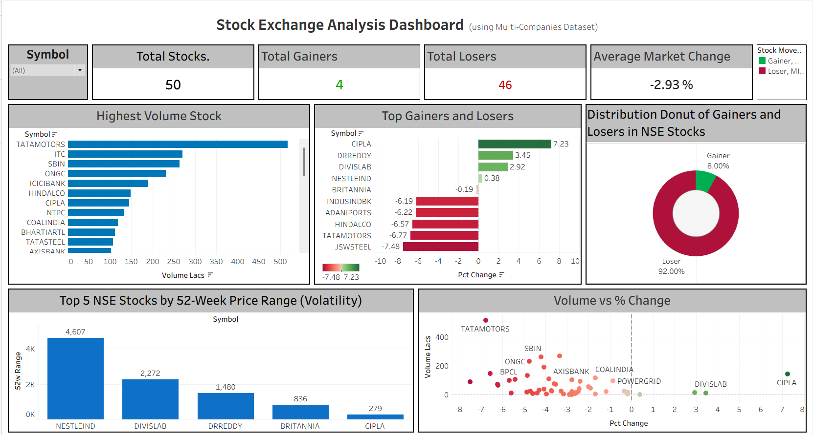

# 📈 Stock Exchange Analysis Dashboard

An interactive Tableau dashboard analyzing NSE (National Stock Exchange) stock data across 50 multi-company stocks — tracking gainers, losers, volume trends, volatility, and price movement patterns.

## 🚀 Live Demo

---

## 🔍 Overview

This dashboard provides a quick, visual snapshot of NSE stock performance using a multi-company dataset. It's designed to help identify market trends, high-volume movers, top gainers/losers, and volatility patterns at a glance.

## 📊 Dashboard Components

| Visual | Description |
|---|---|
| **Symbol Filter** | Dropdown to filter the entire dashboard by a specific stock symbol |
| **Total Stocks** | Total number of stocks analyzed (50) |
| **Total Gainers / Losers** | Count of stocks that gained vs. lost value |
| **Average Market Change** | Overall average % change across all stocks |
| **Highest Volume Stock** | Bar chart ranking stocks by trading volume (in Lacs) |
| **Top Gainers and Losers** | Diverging bar chart showing % change for top movers |
| **Distribution Donut** | Donut chart showing the proportion of gainers vs. losers |
| **Top 5 Stocks by 52-Week Price Range** | Bar chart highlighting the most volatile stocks over 52 weeks |
| **Volume vs % Change** | Scatter plot correlating trading volume with % price change |

## 🗂️ Dataset

**File:** `NSE_Cleaned_With_Date.csv`

| Column | Description |
|---|---|
| `Date` | Trading date |
| `Symbol` | Stock ticker symbol |
| `Open` / `High` / `Low` / `LTP` | Price data (Last Traded Price) |
| `Change` / `Pct_Change` | Absolute and percentage price change |
| `Volume_Lacs` | Trading volume (in Lacs) |
| `Turnover_Crs` | Turnover in Crores |
| `52w_High` / `52w_Low` | 52-week high/low price |
| `Pct_Change_365d` / `Pct_Change_30d` | % change over 1 year / 1 month |

## 🛠️ Tools Used

- **Tableau Desktop/Public** — Dashboard design & visualization
- **Excel/CSV** — Data cleaning and preparation

## 🚀 How to Use

1. Clone or download this repository
2. Open `Stock_Exchange_Analysis_Dashboard.twbx` in Tableau Desktop (or view on Tableau Public)
3. Use the **Symbol filter** to drill down into any specific stock
4. Hover over charts for detailed tooltips

## 📌 Key Insights

- Out of 50 stocks analyzed, only **4 stocks (8%)** were gainers while **46 (92%)** were losers — indicating a broad market downturn.
- **CIPLA** was the top gainer (+7.23%), while **JSWSTEEL** was the biggest loser (-7.48%).
- **TATAMOTORS** recorded the highest trading volume.
- **NESTLEIND** showed the widest 52-week price range, indicating the highest volatility.

## 👤 Author

**Harmant (Harendra Mani Tripathi)**
M.Sc. Data Science | Data Analytics & BI Enthusiast

---

⭐ If you found this useful, consider giving the repo a star!
